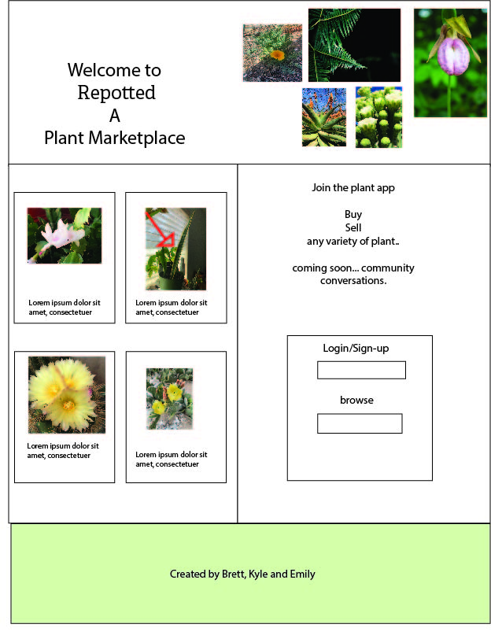
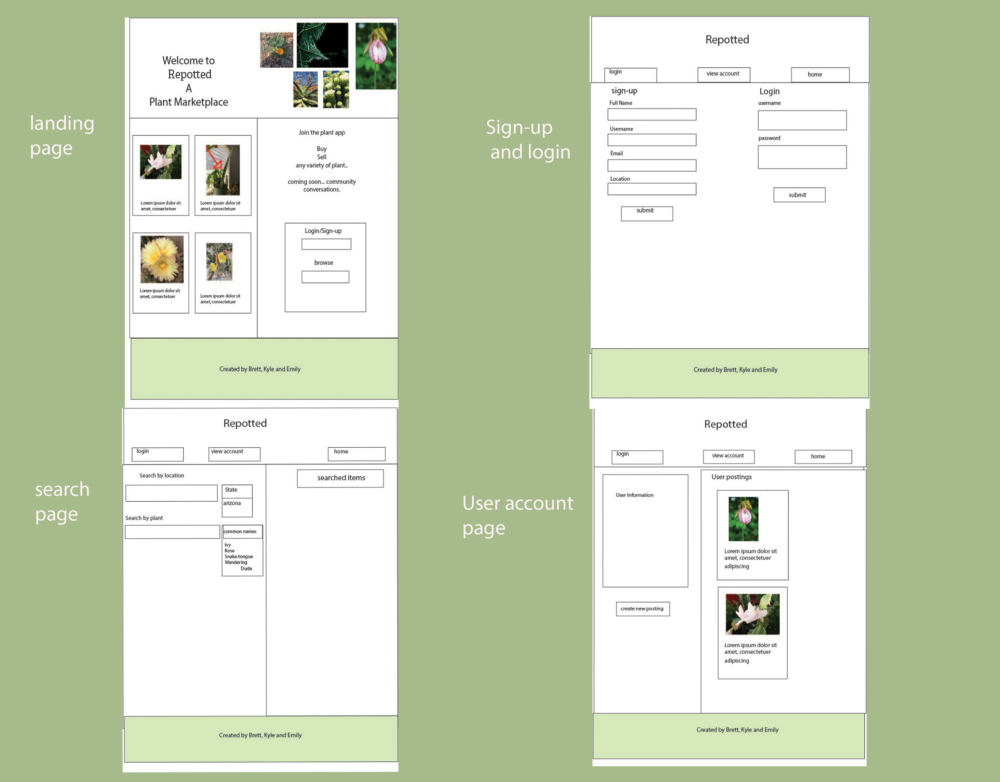

# plant-marketplace

## Github Repo
[Github](https://github.com/bhfreeman/plant-marketplace)

## Overview
```md
A place where plant lovers can buy plants from other people in their area as well as sell their own plants. Users are given the ability to create an account, create postings of the plant they wish to sell as well as browse, filter, and search other plants that are available for purchase. 
```

## User Story 
As an evergreen enthusiast, I want to be able to purchase plants from local sellers in my area as well as give the ability to sell my own plants.  

## Usage  
As a first time visitor, you are given the option to login or browse the plant marketplace. If browsing and not signed in, you will be able to view all relevant information on the plant however you will not have the option to purchase. If signed in, users can then look into their account settings where they can view their own personal information as well as create a posting to sell a plant of theirs. If choosing to sell, they will enter the type of plant and a suggested selling price as well as an option to upload an image. Once created, the post will show the plant type, image (if provided), sellers username, the ability to purchase/contact the seller, and the area the seller is located. Users will also be able to ‘favorite’ sellers posts. 

## Layouts


## Role Breakdown
Brett
Kyle
Emily

## Schedule

## Project Management
```md

```

## Wireframe


